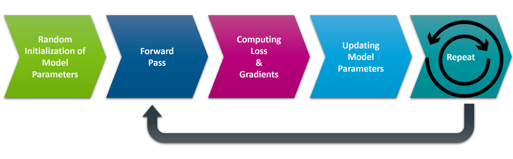

# Deep Learning Fundamentals: From Scratch to PyTorch

In this lecture, we will break down the core steps behind any deep learning algorithm and build intuition through hands-on coding.

## What You'll Learn

We will explain the typical model training loop as shown below:



Using a simple **linear regression** task, we'll explore:

- How models learn
- What role parameters like **learning rate** and **batch size** play
- What **gradient descent** is
- How **optimization** updates model weights

---

## Notebooks

### `DL-Fundamentals.ipynb`

- Manual implementation of a basic deep learning algorithm
- Key concepts:
  - Forward pass
  - Loss calculation
  - Gradients and backpropagation
  - Optimization loop

### `DL-PyTorch.ipynb`

- Introduction to **PyTorch**, Facebook’s deep learning library
- Re-do the linear regression task using PyTorch
- Learn how PyTorch abstracts gradient computation and optimization

---

## 🔥 Why PyTorch?

- **Simple & Intuitive**: Easy to write and debug
- **Flexible**: Dynamic computation graph
- **Rich Ecosystem**: `torchvision`, `torchaudio`, `torchtext` and more
- **Loved by Researchers**: Especially in **physics**, **astroparticle**, and **gravitational wave** communities

---

## How to Install PyTorch

Make sure you have **Python 3.9+** installed.
Go to [PyTorch](https://pytorch.org/) webpage, and follow the instructions  

Example for **Windows + Pip + CUDA 11.8**:

```bash
pip3 install torch torchvision torchaudio --index-url https://download.pytorch.org/whl/cu118
